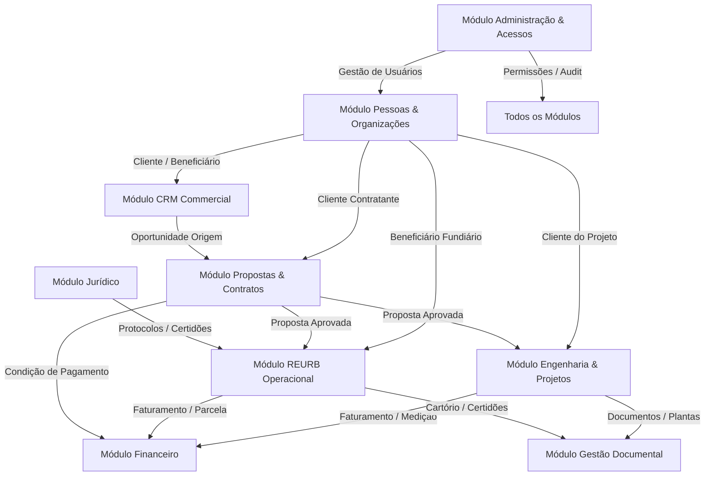

# Plano de Reorganização da Arquitetura Modular do Frontend

> Documento técnico formal de diagnóstico, planejamento e arquitetura para a reorganização modular incremental do frontend do Ravem ERP (`FE-ARCH-001`).

---

## 1. Identificação

| Parâmetro | Valor |
|---|---|
| **Código da Tarefa** | `FE-ARCH-001` |
| **Título** | Reorganização da Arquitetura Modular do Frontend |
| **Área** | Frontend / Arquitetura de Software |
| **Fase** | Fase 0 — Fundação Técnica |
| **Tipo** | Refatoração Estrutural (Não Funcional) |
| **Prioridade** | Alta |
| **Status** | `Concluído — 100% Executado e Homologado` |
| **Natureza** | Não Funcional / Arquitetura |
| **Risco** | Médio / Alto |
| **Dependência** | Aprovação formal da diretoria/liderança técnica |
| **Execução** | Incremental (decomposta em subtarefas `FE-ARCH-001-A` a `FE-ARCH-001-H`) |
| **Impacto Visual Esperado** | Baixo (Preservar Design System `UX-000`) |
| **Impacto Funcional Esperado** | Nenhum durante a reorganização (Preservar comportamento e Supabase RLS) |
| **Responsável Técnico** | Engenheiro de Software Sênior / Arquiteto de Software |
| **Data da Análise** | 21/07/2026 |
| **Documentos Relacionados** | `README.md`, `PROJECT_STATUS.md`, `ROADMAP.md`, `DECISOES_TECNICAS.md`, `docs/05-arquitetura-proposta.md`, `docs/10-design-system.md` |
| **Decisões Técnicas** | `DT-001` (Single-Tenant), `DT-002` (React+Vite+TS+Supabase), `DT-003` (Roles `app_role`), `DT-009` (Design System) |

---

## 2. Contexto

O Ravem ERP nasceu a partir de um protótipo operacional dinâmico em React SPA, focado em validar rapidamente as telas de negócio da Ravem Engenharia. Nas tarefas recentes da Fundação Técnica (`DS-001`, `RBAC-002`, `UX-000`, `CRM-001`, `CRM-002`, `CRM-003`, `NAV-001`, `PROP-001`, `ENG-001`), o sistema evoluiu significativamente com a introdução do Design System unificado e da integração real com o Supabase PostgreSQL (autenticação, políticas RLS, auditoria automatizada e serviços persistentes).

Contudo, a estrutura física do diretório `src/` ainda preserva heranças da fase de prototipagem rápida. Atualmente, coexistem no mesmo projeto:
1. Módulos modernos já integrados ao Supabase e orientados por RLS (como `people`, `crm_opportunities`, `commercial_proposals`, `engineering_projects`).
2. Componentes monolíticos legados baseados em mocks temporários (como `ReurbOperacional.tsx`, `Juridico.tsx`, `RhAdministrativo.tsx`, `PainelFinanceiro.tsx`).
3. Uma centralização excessiva de roteamento e estados de navegação em `src/modules/Pages.tsx`.
4. Um acoplamento indevido entre cadastros centrais (como Pessoas) e departamentos específicos (como o CRM Comercial).

À medida que o ERP se prepara para a expansão dos módulos da Fase 1 (REURB, Financeiro avançado, Contratos e Portal do Cliente), a reorganização da arquitetura modular do frontend torna-se um pré-requisito estrutural indispensável para evitar o encadeamento de dívidas técnicas e garantir manutenibilidade a longo prazo.

---

## 3. Problema Diagnosticado

A inspeção detalhada do código-fonte em `src/` revelou os seguintes problemas estruturais:

1. **Centralização de Roteamento em Monólito (`modules/Pages.tsx`)**:
   O arquivo `Pages.tsx` acumula 777 linhas concentrando a definição de wrappers de páginas, sub-abas internas via `searchParams` e `useState`, chamadas de serviços e regras de visibilidade. Isso impede o carregamento sob demanda (*code splitting* via `React.lazy`) e dificulta o isolamento de testes.

2. **Subordinação Indevida do Cadastro de Pessoas ao CRM**:
   A listagem de clientes e pessoas (`PeopleList.tsx`) e o modal de cadastro (`PersonFormModal.tsx`) estão fisicamente localizados em `src/modules/crm/`. Pessoas/Organizações são entidades centrais de negócio consumidas por Engenharia, REURB, Financeiro e Contratos, não devendo pertencer ao departamento Comercial.

3. **Localização Inadequada de Serviços de Domínio em `shared/lib/`**:
   Serviços específicos de domínio (`peopleService.ts`, `crmService.ts`, `proposalService.ts`, `engineeringService.ts`, `adminService.ts`) estão concentrados na pasta `src/shared/lib/`. A pasta `shared` deve conter apenas utilitários genuinamente transversais (como o cliente do Supabase `supabase.ts`).

4. **Monólito de Tipos Globais (`src/types.ts`)**:
   Todas as interfaces TypeScript do sistema (386 linhas) estão centralizadas em um único arquivo `src/types.ts`, misturando conceitos de Colaborador, Ponto, Ausência, Proposta, Lead, REURB, DRE, Jurídico e Engenharia. Isso gera dependências circulares e acoplamento entre módulos independentes.

5. **Acoplamento da Gestão de Acessos com o Dashboard da Gerência**:
   A tela de Gestão de Acessos & Permissões (`AccessControl.tsx`) é renderizada como uma sub-aba do "Painel da Gerência" (`CentroComando.tsx`) em `Pages.tsx`. Trata-se de uma funcionalidade puramente administrativa que deve residir no módulo de Administração do sistema.

6. **Mistura entre Componentes Legados com Mocks e Módulos Persistidos**:
   Componentes monolíticos grandes como `ReurbOperacional.tsx` (130KB), `Juridico.tsx` (62KB) e `RhAdministrativo.tsx` (46KB) residem na pasta raiz `src/components/`, enquanto módulos persistidos modernos habitam subpastas de `src/modules/`.

7. **Sidebar com Papel Duplo de Navegação e Regra de Segurança**:
   O componente `Sidebar.tsx` contém um array estático que mistura atalhos pessoais, módulos operacionais, visões administrativas e rotas de desenvolvimento (`dev/playground`), além de realizar filtragem visual por `allowedRoles`. A segurança real depende do Supabase RLS, mas a navegação do frontend não possui uma camada de configuração desacoplada.

8. **Ambiguidade entre "Área de Trabalho" e Módulo de Engenharia**:
   A rota `/area-trabalho` renderiza a listagem de Projetos de Engenharia (`EngineeringProjectsList.tsx`), enquanto o componente legado `AreaTrabalho.tsx` (44KB) permanece inativo. A nomenclatura precisa alinhar a visão pessoal do colaborador com a gestão de projetos de engenharia.

9. **Playground de UI Exposto no Menu Funcional**:
   A rota `/dev/playground` é renderizada como um item funcional na Sidebar em modo DEV. Ferramentas de desenvolvimento devem ser isoladas na pasta `src/dev/` e inacessíveis na navegação comercial/operacional.

---

## 4. Inventário Atual da Arquitetura

A tabela a seguir apresenta o diagnostico detalhado de cada arquivo/diretório relevante do frontend atual:

| Arquivo ou Diretório | Responsabilidade Atual | Domínio Real | Estado | Problema Identificado | Destino Recomendado |
|---|---|---|---|---|---|
| `src/modules/Pages.tsx` | Roteamento central e controle de sub-abas | Shell / Router | Compartilhado | Monólito de 777 linhas concentrando rotas e estados de sub-aba | `src/app/router/` e `routes.tsx` por módulo |
| `src/components/Sidebar.tsx` | Menu lateral e filtro visual por papel | Shell / Navegação | Compartilhado | Mistura categorias de navegacao e regras de papéis hardcoded | `src/app/navigation/sidebarConfig.ts` e `src/app/layouts/` |
| `src/modules/engineering/EngineeringProjectsList.tsx` | Gestão de projetos de engenharia e etapas | Engenharia & Projetos | Persistido (Supabase) | Renderizado sob rota `/area-trabalho` sem subrotas próprias | `src/modules/engineering/pages/EngineeringProjectsPage.tsx` |
| `src/modules/crm/PeopleList.tsx` | Listagem e filtro de pessoas (PF/PJ) | Cadastros / Pessoas | Persistido (Supabase) | Subordinado fisicamente à pasta `modules/crm/` | `src/modules/people/pages/PeopleListPage.tsx` |
| `src/modules/crm/PersonFormModal.tsx` | Form modal para cadastro de pessoas | Cadastros / Pessoas | Persistido (Supabase) | Subordinado à pasta `modules/crm/` | `src/modules/people/components/PersonFormModal.tsx` |
| `src/components/CrmComercial.tsx` | Pipeline Kanban de oportunidades | CRM / Vendas | Persistido (Supabase) | Monólito em `src/components/` com chamadas diretas de propostas | `src/modules/crm/pages/CrmPipelinePage.tsx` |
| `src/components/PropostasContratos.tsx` | Emissão e visualização de propostas | Propostas & Contratos | Persistido (Supabase) | Monólito de 32KB em `src/components/` unindo lista e visualizador timbrado | `src/modules/proposals/pages/` e `components/` |
| `src/modules/admin/AccessControl.tsx` | Gestão de usuários e permissões RBAC | Administração | Persistido (Supabase) | Acessado como sub-aba interna do Painel da Gerência | `src/modules/admin/pages/AccessControlPage.tsx` |
| `src/components/CentroComando.tsx` | Dashboard executivo da gerência | Gestão Executiva | Parcialmente Persistido | Mistura métricas reais do Supabase com mocks residuais | `src/modules/dashboard/pages/ExecutiveDashboardPage.tsx` |
| `src/components/ReurbOperacional.tsx` | Gestão de regularização fundiária | REURB | Baseado em Mock | Monólito de 130KB em `src/components/` sem persistência em banco | `src/modules/reurb/` (com futura migration de banco) |
| `src/components/PainelFinanceiro.tsx` | Lançamentos financeiros e DRE | Financeiro | Baseado em Mock | Monólito em `src/components/` sem persistência em banco | `src/modules/finance/pages/FinancePage.tsx` |
| `src/components/Juridico.tsx` | Protocolos e recados jurídicos | Jurídico | Baseado em Mock | Monólito de 62KB em `src/components/` sem persistência em banco | `src/modules/legal/pages/LegalPage.tsx` |
| `src/components/RhAdministrativo.tsx` | Cadastro de equipe, ponto e férias | RH / Administrativo | Baseado em Mock | Monólito de 46KB em `src/components/` sem persistência em banco | `src/modules/hr/pages/HrPage.tsx` |
| `src/components/CalendarioEscritorio.tsx` | Agenda corporativa de eventos | Calendário | Baseado em Mock | Monólito de 30KB na raiz de `src/components/` | `src/modules/calendar/pages/CalendarPage.tsx` |
| `src/modules/dev/DesignSystemPlayground.tsx` | Galeria visual de componentes UI | Ferramenta Dev | Compartilhado / Dev | Exposto no menu funcional de navegação em modo DEV | `src/dev/playground/DesignSystemPlayground.tsx` |
| `src/components/AreaTrabalho.tsx` | Visão legada de tarefas pessoais | Tarefas / Legado | Sem uso ativo na rota | Código legado inativo mantido na raiz de `components/` | `src/modules/tasks/` ou arquivamento técnico |
| `src/components/Launchpad.tsx` | Modal de atalhos e ações rápidas | Shell / Produtividade | Baseado em Mock | Monólito de 43KB misturando atalhos e formulários flutuantes | `src/app/layouts/components/LaunchpadModal.tsx` |
| `src/shared/lib/peopleService.ts` | CRUD e soft-delete de pessoas | Cadastros / Pessoas | Persistido (Supabase) | Localizado na pasta compartilhada `shared/lib/` | `src/modules/people/services/peopleService.ts` |
| `src/shared/lib/crmService.ts` | Gestão de oportunidades no banco | CRM / Vendas | Persistido (Supabase) | Localizado na pasta compartilhada `shared/lib/` | `src/modules/crm/services/crmService.ts` |
| `src/shared/lib/proposalService.ts` | CRUD e cálculo de propostas | Propostas & Contratos | Persistido (Supabase) | Localizado na pasta compartilhada `shared/lib/` | `src/modules/proposals/services/proposalService.ts` |
| `src/shared/lib/engineeringService.ts` | CRUD de projetos e etapas | Engenharia & Projetos | Persistido (Supabase) | Localizado na pasta compartilhada `shared/lib/` | `src/modules/engineering/services/engineeringService.ts` |
| `src/shared/lib/adminService.ts` | Alteração de papéis via RPC | Administração | Persistido (Supabase) | Localizado na pasta compartilhada `shared/lib/` | `src/modules/admin/services/adminService.ts` |
| `src/shared/lib/supabase.ts` | Cliente inicializado do Supabase | Infraestrutura | Compartilhado | Nenhum (Genuinamente compartilhado) | `src/shared/lib/supabase.ts` (Mantido) |
| `src/shared/context/AppStateContext.tsx` | Provedor de estado global de mocks | Estado Global | Parcialmente Persistido | Mantém arrays estáticos de mocks simultâneos ao Supabase | Reduzir gradualmente conforme migração |
| `src/types.ts` | Tipos globais de todos os domínios | Tipagem Global | Compartilhado | Monólito de 386 linhas acoplando todos os domínios | Desmembrar em `types.ts` por módulo em `src/modules/` |

---

## 5. Mapeamento de Dependências Entre Módulos

A arquitetura modular deve refletir com clareza as dependências de negócio reais da Ravem Engenharia, distinguindo relacionamentos válidos de acoplamentos indevidos:



### Análise das Dependências:

1. **Pessoas & Organizações (`people`)**:
   - *Dependência Válida*: Fornece entidades neutras (Clientes, Beneficiários, Parceiros, Fornecedores) para CRM, Propostas, Engenharia, REURB e Financeiro.
   - *Correção Necessária*: Remover a localização física de `PeopleList.tsx` de dentro da pasta `modules/crm/`.

2. **CRM Comercial (`crm`) e Propostas (`proposals`)**:
   - *Dependência Válida*: Uma Oportunidade do CRM pode originar uma Proposta Comercial.
   - *Correção Necessária*: O CRM deve importar o serviço de propostas através de uma interface limpa, sem depender da estrutura interna de visualização do componente de propostas.

3. **Propostas (`proposals`), Engenharia (`engineering`) e REURB (`reurb`)**:
   - *Dependência Válida*: Uma Proposta aprovada pode ser convertida em um Projeto de Engenharia ou em um Processo de REURB.
   - *Correção Necessária*: Preservar a chave `proposal_id` em `engineering_projects` e manter os serviços isolados por módulo.

4. **Portal do Cliente (`portal`)**:
   - *Dependência Futura*: O cliente externo autenticado com papel `client` deve visualizar apenas suas próprias propostas, projetos, documentos e parcelas financeiras.
   - *Isolamento Necessário*: O Portal do Cliente não deve compartilhar o Shell/Sidebar interno dos colaboradores da Ravem.

---

## 6. Fluxo de Negócio Alvo da Arquitetura

A arquitetura do frontend deve suportar nativamente o ciclo operacional completo da Ravem Engenharia:

```plaintext
[Prossecução / Entradas]
   │
   ▼
1. Cadastro de Pessoa / Cliente (Pessoas & Organizações)
   │
   ▼
2. Prospecção / Visita Técnica (CRM Comercial - Oportunidade)
   │
   ▼
3. Emissão e Envio de Proposta Comercial (Propostas & Contratos)
   │
   ├──────────────────────────────┬──────────────────────────────┐
   ▼                              ▼                              ▼
4a. Aprovado: Engenharia       4b. Aprovado: REURB           4c. Recusado / Arquivado
   (Projeto & Milestones)         (Núcleo Fundiário)             (Histórico Comercial)
   │                              │
   ▼                              ▼
5. Execução de Etapas          5. Coleta e Certidões Cartorárias
   (Checklists Técnicos)          (Dossiê e Protocolo Jurídico)
   │                              │
   └──────────────────────────────┴──────────────────────────────┘
   │
   ▼
6. Faturamento e Condição Financeira (Painel Financeiro)
   │
   ▼
7. Entrega Final e Arquivo Histórico (Gestão Documental)
```

### Situação Atual das Etapas no Sistema:
- **Passo 1 (Pessoas)**: 100% Persistido no Supabase (`people`).
- **Passo 2 (CRM)**: 100% Persistido no Supabase (`crm_opportunities`).
- **Passo 3 (Propostas)**: 100% Persistido no Supabase (`commercial_proposals`).
- **Passo 4a / 5 (Engenharia)**: 100% Persistido no Supabase (`engineering_projects` / `engineering_project_stages`).
- **Passo 4b / 5 (REURB)**: Conceitual / Baseado em Mock (Necessita migration futura).
- **Passo 6 (Financeiro)**: Conceitual / Baseado em Mock (Necessita migration futura).
- **Passo 7 (Documental)**: Conceitual.

---

## 7. Árvore de Navegação Recomendada

Com base na especificação funcional da Ravem, na frequência de uso e no limite de até 3 níveis de profundidade de navegação, a árvore de navegação recomendada para o ERP é:

```plaintext
1. INÍCIO (Visão Pessoal & Operação Diária)
   ├── Visão Pessoal (Dashboard do Colaborador)
   ├── Minhas Tarefas & Entregas
   └── Calendário do Escritório

2. CADASTROS (Base Central Compartilhada)
   ├── Pessoas (Clientes, Parceiros e Fornecedores)
   └── Imóveis & Empreendimentos (Futuro)

3. COMERCIAL (Prospecção e Vendas)
   ├── Funil de Vendas (CRM)
   └── Propostas & Contratos

4. OPERAÇÕES (Execução Técnica)
   ├── Engenharia & Projetos
   └── REURB (Regularização Fundiária)

5. GESTÃO & CONSULTORIA (Área Administrativa & Diretoria)
   ├── Painel Financeiro
   ├── Módulo Jurídico
   └── Recursos Humanos (RH)

6. ADMINISTRAÇÃO (Governança & TI - Apenas Admin)
   ├── Gestão de Usuários & Acessos (RBAC)
   ├── Logs de Auditoria
   └── Configurações do Sistema

7. PORTAL DO CLIENTE (Navegação Externa - Papel Client)
   ├── Meus Projetos & Andamentos
   ├── Minhas Propostas
   └── Meus Documentos & Boletos
```

### Regras da Árvore de Navegação:
- Não exibir categorias vazias na Sidebar principal enquanto não houver funcionalidade ativa.
- Exibir badges indicativas apenas quando trouxerem valor operacional.
- O Portal do Cliente possui layout e barra de navegação totalmente isolados da Sidebar interna.

---

## 8. Estrutura de Pastas Recomendada

Para substituir a estrutura monolítica atual, recomenda-se a seguinte organização modular para `src/`:

```plaintext
src/
├── app/                            # Infraestrutura e Bootstrapping da Aplicação
│   ├── layouts/                    # Layouts principais (AppLayout, AuthLayout, ClientPortalLayout)
│   ├── navigation/                 # Configurações tipadas de navegação e menus
│   ├── providers/                  # Encapsulamento de provedores (Auth, Theme, Toast, Query)
│   └── router/                     # Definição modular de rotas e guardas de acesso
│
├── dev/                            # Ferramentas e utilitários de desenvolvimento
│   └── playground/                 # Playground do Design System (/dev/playground)
│
├── modules/                        # Módulos Funcionais de Negócio (Monólito Modular)
│   ├── admin/                      # Módulo de Administração & Acessos
│   │   ├── components/
│   │   ├── pages/
│   │   ├── services/
│   │   └── types.ts
│   │
│   ├── calendar/                   # Módulo de Calendário Corporativo
│   ├── crm/                        # Módulo Comercial & Funil de Vendas
│   ├── dashboard/                  # Módulo de Dashboards & Visão Executiva
│   ├── engineering/                # Módulo de Engenharia & Projetos
│   ├── finance/                    # Módulo Financeiro
│   ├── hr/                         # Módulo de Recursos Humanos
│   ├── legal/                      # Módulo Jurídico
│   ├── people/                     # Módulo de Pessoas & Organizações (Cadastros Centrais)
│   ├── portal/                     # Módulo do Portal do Cliente (Ambiente Externo)
│   ├── proposals/                  # Módulo de Propostas Comerciais & Contratos
│   ├── reurb/                      # Módulo de REURB (Regularização Fundiária)
│   └── tasks/                      # Módulo de Tarefas Pessoais
│
└── shared/                         # Recursos genuinamente transversais
    ├── components/                 # OperationalShell e componentes UI atômicos (src/components/ui)
    ├── context/                    # Contextos globais leves (Theme, Auth)
    ├── hooks/                      # Hooks genéricos (usePersistentState, useDebounce)
    ├── lib/                        # Utilitários de infraestrutura (supabase.ts, utils.ts)
    └── types/                      # Interfaces compartilhadas e enums do banco (app_role, etc.)
```

### Regra de Criação de Pastas:
As pastas de módulos conceituais (como `reurb/`, `finance/`, `legal/`, `hr/`) serão estruturadas e preenchidas **apenas durante a execução de cada subtarefa correspondente**, evitando diretórios vazios no repositório.

---

## 9. Mapa Completo de Movimentação

A tabela a seguir orienta todas as futuras movimentações de arquivos de código, garantindo rastreabilidade e prevenindo quebras de importação durante a execução incremental:

| Origem Atual | Destino Proposto | Tipo de Mudança | Dependências Directas | Risco | Etapa de Execução |
|---|---|---|---|---|---|
| `src/modules/Pages.tsx` | `src/app/router/index.tsx` e `routes.tsx` dos módulos | Refatoração / Desmembramento | Todos os módulos | Alto | `FE-ARCH-001-A` |
| `src/components/Sidebar.tsx` | `src/app/layouts/components/Sidebar.tsx` | Refatoração / Desacoplamento | `sidebarConfig.ts`, `AuthContext` | Médio | `FE-ARCH-001-A` |
| `src/modules/crm/PeopleList.tsx` | `src/modules/people/pages/PeopleListPage.tsx` | Movimentação | `peopleService`, `PersonFormModal` | Baixo | `FE-ARCH-001-B` |
| `src/modules/crm/PersonFormModal.tsx` | `src/modules/people/components/PersonFormModal.tsx` | Movimentação | `peopleService` | Baixo | `FE-ARCH-001-B` |
| `src/shared/lib/peopleService.ts` | `src/modules/people/services/peopleService.ts` | Movimentação | Supabase Client | Baixo | `FE-ARCH-001-B` |
| `src/components/CrmComercial.tsx` | `src/modules/crm/pages/CrmPipelinePage.tsx` | Movimentação | `crmService`, `proposalService` | Médio | `FE-ARCH-001-C` |
| `src/shared/lib/crmService.ts` | `src/modules/crm/services/crmService.ts` | Movimentação | Supabase Client | Baixo | `FE-ARCH-001-C` |
| `src/components/PropostasContratos.tsx` | `src/modules/proposals/pages/ProposalsPage.tsx` | Refatoração | `proposalService`, `peopleService` | Médio | `FE-ARCH-001-C` |
| `src/shared/lib/proposalService.ts` | `src/modules/proposals/services/proposalService.ts` | Movimentação | Supabase Client | Baixo | `FE-ARCH-001-C` |
| `src/modules/engineering/EngineeringProjectsList.tsx` | `src/modules/engineering/pages/EngineeringProjectsPage.tsx` | Movimentação | `engineeringService`, `peopleService` | Baixo | `FE-ARCH-001-D` |
| `src/shared/lib/engineeringService.ts` | `src/modules/engineering/services/engineeringService.ts` | Movimentação | Supabase Client | Baixo | `FE-ARCH-001-D` |
| `src/modules/admin/AccessControl.tsx` | `src/modules/admin/pages/AccessControlPage.tsx` | Movimentação | `adminService` | Baixo | `FE-ARCH-001-E` |
| `src/shared/lib/adminService.ts` | `src/modules/admin/services/adminService.ts` | Movimentação | Supabase Client, RPC | Baixo | `FE-ARCH-001-E` |
| `src/components/CentroComando.tsx` | `src/modules/dashboard/pages/ExecutiveDashboardPage.tsx` | Movimentação | Vários serviços | Médio | `FE-ARCH-001-F` |
| `src/components/ReurbOperacional.tsx` | `src/modules/reurb/pages/ReurbPage.tsx` | Movimentação / Refatoração | Mocks / Futuro Supabase | Médio | `FE-ARCH-001-F` |
| `src/components/PainelFinanceiro.tsx` | `src/modules/finance/pages/FinancePage.tsx` | Movimentação | Mocks / Futuro Supabase | Baixo | `FE-ARCH-001-F` |
| `src/components/Juridico.tsx` | `src/modules/legal/pages/LegalPage.tsx` | Movimentação | Mocks | Baixo | `FE-ARCH-001-F` |
| `src/components/RhAdministrativo.tsx` | `src/modules/hr/pages/HrPage.tsx` | Movimentação | Mocks | Baixo | `FE-ARCH-001-F` |
| `src/components/CalendarioEscritorio.tsx` | `src/modules/calendar/pages/CalendarPage.tsx` | Movimentação | Mocks | Baixo | `FE-ARCH-001-F` |
| `src/components/AreaTrabalho.tsx` | `src/modules/tasks/pages/TasksPage.tsx` | Movimentação / Arquivamento | Mocks legados | Baixo | `FE-ARCH-001-F` |
| `src/modules/dev/DesignSystemPlayground.tsx` | `src/dev/playground/DesignSystemPlayground.tsx` | Movimentação | UI Components | Baixo | `FE-ARCH-001-G` |
| `src/types.ts` | Desmembrado nos arquivos `types.ts` de cada módulo | Desmembramento | Todos os módulos | Alto | `FE-ARCH-001-H` |

---

## 10. Estratégia de Roteamento

A eliminação progressiva do arquivo central `modules/Pages.tsx` seguirá os princípios de roteamento modular moderno:

1. **Rotas limpas e semânticas por módulo**:
   - `/pessoas` — Listagem e gestão de Clientes/Pessoas.
   - `/crm` — Pipeline Comercial e Oportunidades.
   - `/propostas` — Emissão e visualização de Propostas Comerciais.
   - `/engenharia/projetos` — Gestão de Projetos de Engenharia e Etapas.
   - `/reurb` — Processos de Regularização Fundiária.
   - `/financeiro` — Painel Financeiro e DRE.
   - `/administracao/acessos` — Gestão de Usuários e Permissões (RBAC).
   - `/portal/*` — Ambiente do Portal do Cliente.
   - `/dev/playground` — Playground do Design System (Restrito a DEV).

2. **Rotas Protegidas por Permissão por Ação (`PermissionRoute`)**:
   - As rotas serão protegidas pelo componente `<PermissionRoute permission="manage_access_control" />` em vez de checagem direta de papel (`requiredRoles`).
   - Tentativas de acesso não autorizado (onde `hasPermission(profile, permission)` retornar `false`) redirecionarão para a página `/403` (Acesso Negado).
   - URLs inexistentes renderizarão a página `/404` (Não Encontrado).

---

## 11. Estratégia de Navegação (Interface `NavigationItem`)

A navegação da Sidebar será parametrizada através de uma configuração tipada e independente em `src/app/navigation/sidebarConfig.ts`. A interface conceitual final não utilizará array estático de papéis (`allowedRoles: AppRole[]`), e sim uma estrutura baseada em permissões por ação, estado de disponibilidade e ambiente:

```typescript
export type AppEnvironment = 'development' | 'staging' | 'production';

export interface NavigationItem {
  id: string;
  label: string;
  path?: string;
  permission?: PermissionKey;
  children?: NavigationItem[];
  environment?: AppEnvironment[];
  availability?: 'active' | 'planned' | 'disabled';
}
```

### Princípios da Configuração de Navegação:
- A Sidebar lerá a lista de itens e consultará a função `hasPermission(profile, item.permission)` para filtrar visivelmente o menu.
- Itens com `availability: 'planned'` ou `'disabled'` poderão ser exibidos com estado visual desabilitado ou ocultados conforme configuração de homologação.
- Itens restritos a ambiente (`environment: ['development']`) só serão renderizados em ambiente de desenvolvimento (ex: Playground UI).
- A navegação continuará totalmente desacoplada da segurança real de dados, que é executada pelas políticas Supabase RLS no banco de dados.

---

## 12. Estratégia de Permissões por Ação (Abstração do RBAC)

Em vez de comparar papéis diretamente no frontend (`profile.role === 'admin'`), o sistema adotará uma arquitetura de **Permissões por Ação** utilizando os conceitos de `PermissionKey`, `hasPermission()` e `PermissionRoute`.

### 12.1 Mapeamento e Matriz Temporária de Permissões
Os papéis atuais do banco (`admin`, `manager`, `employee`, `partner`, `client`, `pending`) definidos em `DT-003` permanecerão **rigorosamente inalterados**, assim como a RPC `update_user_role_status` e as políticas RLS. Eles funcionarão temporariamente como geradores de uma matriz de permissões interna no frontend:

```typescript
export type PermissionKey =
  | 'view_people'
  | 'manage_people'
  | 'view_crm'
  | 'manage_crm'
  | 'view_proposals'
  | 'manage_proposals'
  | 'view_engineering'
  | 'manage_engineering'
  | 'view_reurb'
  | 'manage_reurb'
  | 'view_finance'
  | 'manage_finance'
  | 'view_legal'
  | 'view_hr'
  | 'manage_hr'
  | 'manage_access_control'
  | 'view_playground';

export const ROLE_PERMISSIONS_MAP: Record<AppRole, PermissionKey[]> = {
  admin: [
    'view_people', 'manage_people',
    'view_crm', 'manage_crm',
    'view_proposals', 'manage_proposals',
    'view_engineering', 'manage_engineering',
    'view_reurb', 'manage_reurb',
    'view_finance', 'manage_finance',
    'view_legal', 'view_hr', 'manage_hr',
    'manage_access_control', 'view_playground'
  ],
  manager: [
    'view_people', 'manage_people',
    'view_crm', 'manage_crm',
    'view_proposals', 'manage_proposals',
    'view_engineering', 'manage_engineering',
    'view_reurb', 'manage_reurb',
    'view_finance', 'view_legal', 'view_hr', 'view_playground'
  ],
  employee: [
    'view_people', 'manage_people',
    'view_crm', 'manage_crm',
    'view_proposals', 'manage_proposals',
    'view_engineering', 'manage_engineering',
    'view_reurb', 'view_playground'
  ],
  partner: [
    'view_people',
    'view_engineering',
    'view_reurb'
  ],
  client: [
    'view_proposals',
    'view_engineering'
  ],
  pending: []
};
```

### 12.2 Função `hasPermission()`
A verificação no frontend será padronizada via helper:

```typescript
export function hasPermission(profile: Profile | null, permission?: PermissionKey): boolean {
  if (!permission) return true;
  if (!profile || profile.status !== 'active') return false;
  
  const userPermissions = ROLE_PERMISSIONS_MAP[profile.role] || [];
  return userPermissions.includes(permission);
}
```

- **Vantagem**: Quando o backend futuramente migrar para uma tabela de permissões granulares por ação ou escopo de registro, a assinatura de `hasPermission()` e das rotas `PermissionRoute` permanecerá inalterada no frontend, garantindo acoplamento zero.
- **Isolamento do Papel `client`**: O perfil `client` será redirecionado para o Shell do Portal do Cliente (`/portal`), consumindo apenas as permissões associadas a propostas e andamento de seus próprios projetos.

---

## 13. Isolamento Arquitetural do Portal do Cliente

O Portal do Cliente será mantido dentro do mesmo projeto React/Vite para evitar duplicação de build e componentes, mas possuirá um isolamento arquitetural completo:

- **Rota Raiz própria**: `/portal/*`.
- **Layout dedicado**: `ClientPortalLayout.tsx` (sem Sidebar interna, sem acesso a dados da empresa).
- **Proteção RLS**: O Supabase continuará garantindo que a role `client` consulte apenas os registros onde seu `auth.uid()` ou `person_id` esteja explicitamente vinculado.

---

## 14. Ferramentas de Desenvolvimento (Playground)

- **Localização Futura**: `src/dev/playground/DesignSystemPlayground.tsx`.
- **Proteção de Ambiente**: O item de menu do Playground será exibido na Sidebar somente quando `import.meta.env.DEV` for verdadeiro ou o perfil for `admin` em ambiente de homologação.
- **Isolamento de Production**: O código do Playground será excluído do bundle de produção via tree-shaking do Vite.

---

## 15. Estratégia Incremental de Execução (Decomposição em Subtarefas)

A futura reorganização será executada estritamente em **8 subtarefas sequenciais, pequenas e reversíveis**:

### ➔ Subtarefa FE-ARCH-001-A: Fundação de Roteamento e Shell de Navegação
- **Objetivo**: Criar a estrutura base de roteamento em `src/app/router/` e parametrizar a Sidebar com `sidebarConfig.ts`.
- **Escopo**: Criar `AppLayout`, `ProtectedRoute`, `sidebarConfig.ts`.
- **Fora de Escopo**: Mover componentes de módulos funcionais.
- **Estimativa de Esforço**: Médio.
- **Risco**: Médio (Garantir que as rotas atuais continuem funcionando via redirects temporários).

### ➔ Subtarefa FE-ARCH-001-B: Extração e Isolamento do Módulo de Pessoas (`people`)
- **Objetivo**: Mover `PeopleList.tsx`, `PersonFormModal.tsx` e `peopleService.ts` para o novo módulo `src/modules/people/`.
- **Escopo**: Criar pasta `src/modules/people/`, reexportar serviços e atualizar imports.
- **Fora de Escopo**: Alterar visual da tela ou alterar a tabela `people` no Supabase.
- **Estimativa de Esforço**: Pequeno.
- **Risco**: Baixo.

### ➔ Subtarefa FE-ARCH-001-C: Reorganização dos Módulos Comercial (`crm`) e Propostas (`proposals`)
- **Objetivo**: Separar as responsabilidades físicas e lógicas do CRM Comercial e do Gerador de Propostas.
- **Escopo**: Mover `CrmComercial.tsx` e `crmService.ts` para `src/modules/crm/`; mover `PropostasContratos.tsx` e `proposalService.ts` para `src/modules/proposals/`.
- **Fora de Escopo**: Alterar lógica de cálculo de propostas ou Kanban.
- **Estimativa de Esforço**: Médio.
- **Risco**: Baixo.

### ➔ Subtarefa FE-ARCH-001-D: Reorganização do Módulo de Engenharia & Projetos (`engineering`)
- **Objetivo**: Posicionar a gestão de projetos sob a rota semântica `/engenharia/projetos`.
- **Escopo**: Mover `EngineeringProjectsList.tsx` e `engineeringService.ts` para `src/modules/engineering/`.
- **Fora de Escopo**: Alterar tabela de projetos ou etapas no Supabase.
- **Estimativa de Esforço**: Pequeno.
- **Risco**: Baixo.

### ➔ Subtarefa FE-ARCH-001-E: Organização do Módulo de Administração & Acessos (`admin`)
- **Objetivo**: Isolar o painel de controle de usuários em `src/modules/admin/` acessível pela rota `/administracao/acessos`.
- **Escopo**: Mover `AccessControl.tsx` e `adminService.ts`.
- **Fora de Escopo**: Alterar função RPC `update_user_role_status`.
- **Estimativa de Esforço**: Pequeno.
- **Risco**: Baixo.

### ➔ Subtarefa FE-ARCH-001-F: Reorganização dos Módulos Conceituais e Componentes Legados
- **Objetivo**: Mover componentes monolíticos de `src/components/` para suas respectivas pastas em `src/modules/` (`reurb`, `finance`, `legal`, `hr`, `calendar`, `dashboard`).
- **Escopo**: Organizar estrutura física das telas baseadas em mocks sem alterar seus estados visuais.
- **Fora de Escopo**: Migrar mocks para o Supabase (será feito em tarefas funcionais futuras).
- **Estimativa de Esforço**: Grande.
- **Risco**: Médio.

### ➔ Subtarefa FE-ARCH-001-G: Isolamento do Portal do Cliente e Ferramentas Dev
- **Objetivo**: Criar o Shell do Portal do Cliente em `src/modules/portal/` e mover o Playground para `src/dev/playground/`.
- **Escopo**: Garantir o isolamento das rotas externas `/portal/*` e ocultar o Playground de produção.
- **Fora de Escopo**: Implementar novas funcionalidades do Portal.
- **Estimativa de Esforço**: Pequeno.
- **Risco**: Baixo.

### ➔ Subtarefa FE-ARCH-001-H: Limpeza, Desmembramento do `types.ts` e Consolidação
- **Objetivo**: Desmembrar o arquivo monolítico `src/types.ts` nos arquivos de tipagem de cada módulo e validar a compilação final.
- **Escopo**: Criar `types.ts` por módulo, manter tipos globais em `src/shared/types/`, executar `npm run lint` e `npm run build`.
- **Fora de Escopo**: Alterar contratos de tipos existentes.
- **Estimativa de Esforço**: Médio.
- **Risco**: Baixo.

---

## 16. Estratégia de Rollback

Para garantir que a reorganização seja 100% segura e reversível a qualquer momento:

1. **Commits Granulares**: Cada subtarefa (`FE-ARCH-001-A` a `H`) gerará um commit Git isolado e homologado.
2. **Re-exports Temporários (Aliases)**: Durante as etapas intermediárias de movimentação, os arquivos originais poderão manter um re-export (ex: `export * from '../modules/people/services/peopleService'`) para evitar quebrar imports não mapeados.
3. **Imutabilidade do Backend**: Nenhuma alteração no Supabase (tabelas, colunas, RPCs ou RLS) será realizada durante a execução desta refatoração de frontend.
4. **Validação Contínua**: Execução obrigatória de `npm run lint` e `npm run build` ao término de cada subtarefa antes da mesclagem.

---

## 17. Análise de Riscos

| Risco Identificado | Probabilidade | Impacto | Estratégia de Mitigação | Indicador de Ocorrência |
|---|---|---|---|---|
| Imports quebrados por movimentação de arquivos | Média | Alto | Utilizar busca global (grep) antes de mover arquivos e manter re-exports temporários | Erros no `npm run lint` ou `tsc --noEmit` |
| Quebra de navegação em sub-abas existentes | Média | Médio | Mapear redirecionamentos temporários de URLs antigas no React Router | Tela em branco ou rota 404 inesperada |
| Regressão em permissões de acesso da Sidebar | Baixa | Alto | Testar a navegação logado com os 6 papéis do sistema (`admin`, `manager`, `employee`, `partner`, `client`, `pending`) | Usuário comum visualizando menus restritos |
| Erro de escopo (tentar refatorar layout visual junto com a movimentação) | Média | Médio | Proibir alterações em componentes visuais durante as subtarefas de reorganização | Diferenças visuais no `git diff` de componentes |

---

## 18. Decisões Arquiteturais Pendentes

As seguintes questões técnicas e de negócio estão mapeadas e deverão ser formalizadas pela equipe antes ou durante a execução das subtarefas correspondentes:

1. **Projetos vs. Ordens de Serviço (OS)**: A Engenharia tratará Projetos e Ordens de Serviço como entidades separadas no banco ou como fases de um mesmo objeto?
2. **Contratos Comerciais**: O módulo de Contratos deverá ser isolado do módulo de Propostas imediatamente na Fase 1 ou manterem-se sob a mesma pasta `proposals_contracts`?
3. **Persistência do REURB e Financeiro**: A migração dos componentes `ReurbOperacional.tsx` e `PainelFinanceiro.tsx` para o Supabase será feita em tarefas dedicadas logo após o encerramento de `FE-ARCH-001`?
4. **Adopção de React Query / TanStack Query**: Na subtarefa `FE-ARCH-001-A`, já devemos deixar a infraestrutura de `QueryClientProvider` pronta para a futura substituição do `AppStateContext`?

---

## 19. Critérios Gerais de Aceite para a Futura Execução

A execução da tarefa `FE-ARCH-001` será considerada totalmente concluída quando:

- [ ] A aplicação compilar com sucesso via `npm run build` em todas as subtarefas.
- [ ] O verificador de tipos TypeScript (`npm run lint` / `tsc --noEmit`) retornar 0 erros.
- [ ] Todas as rotas do sistema responderem com URLs limpas, semânticas e persistentes no navegador.
- [ ] O módulo de Pessoas (`people`) estiver completamente desacoplado da pasta do CRM.
- [ ] A tela de Gestão de Acessos (`AccessControl`) estiver integrada ao módulo de Administração.
- [ ] A Sidebar utilizar a estrutura de configuração tipada (`sidebarConfig.ts`).
- [ ] O Playground do Design System estiver isolado na pasta `src/dev/playground` e oculto do menu funcional de produção.
- [ ] O arquivo monolítico `src/types.ts` estiver desmembrado pelos respectivos módulos.
- [ ] Todas as chamadas de serviços e políticas de segurança RLS do Supabase estarem 100% preservadas e funcionais.

---

## 20. Recomendação Final do Arquiteto

- **Parecer Técnico**: A reorganização da arquitetura do frontend é uma medida altamente recomendada e urgente. A estrutura atual atendeu perfeitamente ao propósito de validar o MVP, mas atingiu seu limite de sustentabilidade.
- **Momento Ideal de Execução**: Imediatamente após a homologação deste plano, antes do início da persistência dos módulos complexos de REURB e Financeiro.
- **Riscos de Adiar**: Continuar criando módulos sobre a estrutura atual aumentará exponencialmente o esforço de refatoração futuro e o risco de regressões em produção.
- **Riscos de Executar de Forma Big-Bang**: Tentar refatorar o frontend inteiro em um único commit é proibido. A execução **deve respeitar rigorosamente a divisão incremental das subtarefas `FE-ARCH-001-A` a `FE-ARCH-001-H`**.
